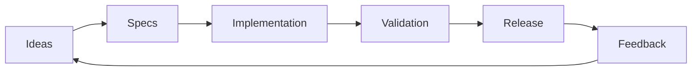
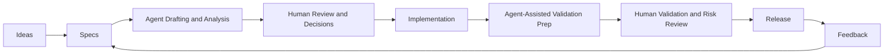
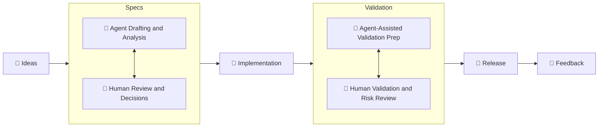

# Economics of Spec-Driven Software Engineering

## 1. Purpose and audience
- State the problem this paper is trying to solve: a shared mental model for reasoning about spec-driven software engineering in a large, mature organization.
- Name the intended readers: project managers, engineering managers, and tech leads working within existing agile operating models.
- Explain why a shared vocabulary matters before debating whether SDD is “good” or “bad.”

## 2. Executive summary
- Define the core claim of the paper in one paragraph.
- Preview the key idea: SDD is not only a delivery technique, but an organizational model for allocating human effort, agent effort, and verification work.
- Preview the main tradeoff: better coordination and leverage versus new costs in specification quality, review, governance, and token consumption.

## 3. Definitions and scope
### 3.1 What spec-driven software engineering means here
- Define SDD in operational terms, not as a slogan.
- Distinguish specs as executable or semi-executable intent from code implementation.
- Clarify that the paper is about organizing work around specs, not replacing engineering judgment.

### 3.2 What this paper is not
- Not a greenfield startup pattern.
- Not a replacement for Scrum, Kanban, or SAFe.
- Not a claim that agents remove the need for human accountability.

### 3.3 Key terms used throughout
- Human work.
- Agent work.
- Token allocation.
- Labor allocation.
- Specification quality.
- Verification and review.

## 4. The mental model
### 4.1 Start from a familiar SDLC flow
In a traditional human-only model, this flow is often discussed as a sequence of team handoffs. In SDD, the same flow remains, but each stage becomes a collaboration surface between humans and agents. The key point is that SDD does not replace the flow; it changes where effort is spent and where coordination risk appears.

### 4.2 High-level functional view
At high level, this model has three functional layers:
- Intent layer: Ideas and Specs, where teams decide what should be built and why.
- Execution layer: Implementation, where intent is converted into working software artifacts.
- Assurance layer: Validation and Release, where teams confirm that outcomes are correct, safe, and operable.

Feedback closes the loop by updating intent based on real outcomes.

The primary organizational question is how to allocate decision rights, production work, and verification work across the layers between humans and agents.

### 4.3 Interaction topology for SDD
We use work allocation-based terms to talk about the human-agent collaboration in each stage of the flow:
- Human-primary work: high-entropy activities where most effort and accountability are carried by humans, even when agents assist.
- Agent-primary work: low-entropy activities where most execution effort is delegated to agents, with humans providing direction, review, and approval.

The simplified model that takes into account human-agent collaboration:

- Humans always remain accountable for intent, risk, and acceptance (Human-In-The-Loop principle).
- The throughput of the system depends on the slowest human review or decision point, not the speed of agent generation. While parallelization of agent work is obviously possible, it is unlikely to improve performance of the whole system.
- A priori, none of the steps in the loop are purely human or purely agent work. The performance of the system likely depends on optimization of the human-primary work, possibly by automation (agent-assisted or deterministic).
- One of the ways to reduce the need for human work is to create a framework that promotes creation of low-entropy artifacts (that is: organization, par excellence).

### 4.4 Where human-agent interaction becomes relevant

#### 4.4.1 Ideas
- Human-primary work: problem framing, priority setting, tradeoff selection, stakeholder alignment.
- Agent-primary work: summarization of prior incidents, demand pattern clustering, draft option generation.
- Interaction risk: teams may mistake generated option sets for strategic decisions.

#### 4.4.2 Specs
- Human-primary work: ambiguity removal, boundary definition, acceptance criteria, non-functional constraints.
- Agent-primary work: spec drafting, gap detection, consistency checks, trace link suggestions.
- Interaction risk: high-volume spec text can create false confidence if assumptions are not explicitly tested.

#### 4.4.3 Implementation
- Human-primary work: architecture decisions, integration choices, exception handling, dependency negotiation.
- Agent-primary work: code draft generation, refactoring transforms, boilerplate production, test scaffold generation.
- Interaction risk: output quantity can exceed review capacity, creating hidden quality debt.

#### 4.4.4 Validation
- Human-primary work: risk-based test strategy, scenario selection, defect triage, release readiness judgment.
- Agent-primary work: test case expansion, mutation or fuzz inputs, regression impact summarization.
- Interaction risk: teams can over-index on executable checks and underweight business correctness.

#### 4.4.5 Release
- Human-primary work: change approval, operational coordination, rollback decisions, stakeholder communication.
- Agent-primary work: release note drafting, checklist completion, deployment script generation.
- Interaction risk: automation can compress timing while governance still requires explicit human accountability.

#### 4.4.6 Feedback
- Human-primary work: interpretation of outcomes, policy adjustments, backlog reprioritization.
- Agent-primary work: telemetry summarization, anomaly detection, pattern extraction.
- Interaction risk: teams can optimize for measurable signals while missing strategic or customer-context signals.

## 4.5 Approximation of a realistic SDD flow
For the purpose of this discussion let's consider a model that focuses on what matters for a perticular, hypothetical organization Acme. In this model, we assume that:
- Ideas are generated by humans.
- Specs are drafted by agents but reviewed and approved by humans.
- Implementation is done by agents only.
- Validation is assisted by agents but ultimately reviewed and approved by humans.
- Release is done byu humans with deterministic CI/CD pipelines.
- Feedback is collected and processed by humans.

## 5. Organizational economics
### 5.1 Labor allocation versus token allocation
- Explain the difference between paying for human attention and paying for machine generation.
- Describe how token-heavy workflows can look cheap locally but expensive at scale.
- Discuss how labor and token budgets interact in planning and governance.

### 5.2 Cost shifts rather than cost removal
- More emphasis on specification, review, and validation.
- Less emphasis on hand-coded first drafts in some workstreams.
- New overhead in orchestration, policy, and auditability.

### 5.3 Economic questions leaders should ask
- Where does agent work create real leverage?
- Where does it simply move effort from coding to review?
- What parts of the system are sensitive to error cost, delay cost, or rework cost?

## 6. Human work and agent work
### 6.1 Human work
- Problem framing.
- Ambiguity reduction.
- Architectural judgment.
- Cross-team negotiation.
- Review, accountability, and escalation.

### 6.2 Agent work
- Drafting code from spec.
- Producing repetitive transformations.
- Generating test scaffolding.
- Summarizing or tracing requirements where appropriate.

### 6.3 Boundary conditions
- Human oversight is mandatory where ambiguity, risk, or organizational consequences are high.
- Agent output is only valuable when the spec and verification system are strong enough to contain errors.

## 7. Fit with agile operating models
### 7.1 Scrum
- How SDD changes backlog refinement, sprint planning, and definition of done.
- Where specs can reduce ambiguity in sprint execution.

### 7.2 Kanban
- How SDD affects flow efficiency, work-in-progress, and upstream readiness.
- How specification quality influences throughput.

### 7.3 SAFe and large-scale coordination
- How SDD interacts with program increment planning, dependency management, and governance.
- Why large organizations need explicit review and verification gates.

## 8. Where SDD improves flow
- Better coordination across distributed teams.
- Earlier validation of intent.
- Reduced rework when specs are high quality.
- More leverage from repeatable, agent-assisted work.
- Clearer accountability when specs are treated as operational artifacts.

## 9. Where SDD introduces tradeoffs
- Specification overhead can slow the start of work.
- Poor specs can scale defects faster than manual coding mistakes.
- Review burden can shift from implementation to intent and traceability.
- Governance can become too heavy if every artifact is treated as equally important.
- Token cost can become invisible if teams optimize locally.

## 10. Decision framework
### 10.1 When SDD is a good fit
- Stable interfaces.
- Repetitive or well-bounded work.
- High cost of coordination errors.
- Strong review and verification culture.

### 10.2 When to be cautious
- Highly exploratory work.
- Rapidly changing requirements.
- Weak test or review discipline.
- Low tolerance for specification overhead.

### 10.3 Questions for leaders
- What problem are we solving with SDD in this organization?
- Which work types should be spec-driven first?
- Which controls are mandatory, and which are optional?

## 11. Operating implications
### 11.1 Planning
- Estimate spec effort separately from build effort where useful.
- Treat upstream clarity as a capacity question, not just a documentation question.

### 11.2 Review and approval
- Define who approves specs, implementation, and release readiness.
- Avoid unclear ownership between product, engineering, and platform teams.

### 11.3 Verification
- Make tests, checks, and human review part of the system design.
- Use verification to constrain agent-generated work.

### 11.4 Accountability
- Preserve human accountability even when agents produce most of the first draft.
- Make traceability explicit from requirement to spec to implementation to evidence.

## 12. Examples and scenarios
- A low-risk, repetitive workflow where SDD improves throughput.
- A cross-team integration effort where SDD improves coordination.
- A high-ambiguity effort where SDD should be introduced carefully.

## 13. Recommendations
- Start with work that benefits from clarity, repeatability, and strong verification.
- Treat spec quality as a first-class engineering concern.
- Measure both flow improvements and review overhead.
- Align budgeting, planning, and governance around labor plus token economics.

## 14. Conclusion
- Restate the central mental model.
- Emphasize that SDD is an organizational choice with economic and operational consequences.
- End with the practical test: whether the model helps teams make better decisions about work allocation, accountability, and leverage.
